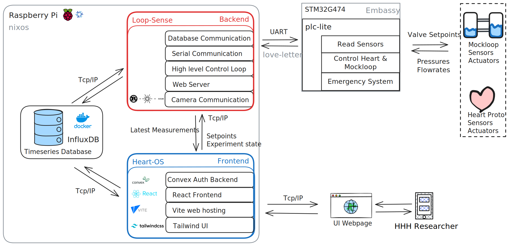

# loop-sense

A data acquisition and control application for the Holland Hybrid Heart mockloop
designed to run on a SBC (e.g. Raspberry pi 3/4/5).
It interfaces with a microcontroller/PLC via EtherCAT, logs sensor data and
mockloop state to InfluxDB3 and hosts a web interface for monitoring.

# Architecture

# Features

- Modular Async Rust using the [Tokio] executor.
- Designed to work with [Influxdb3], a time-series optimized DB.
- Structured logging via [Tracing], optionally exported to InfluxDB3.
- Uses the [Axum] web framework.
- Optional: High-frequency mockloop data acquisition and control via DAQ/NIDAQ
  (Replacing the PLC).

# Building

First install [Rust].

To build this application you must first obtain a rust toolchain.
[Rustup] is the default Rust toolchain manager, on unix & MacOS install it using `curl --proto '=https' --tlsv1.2 -sSf https://sh.rustup.rs | sh`.
If you are on windows [refer here](https://forge.rust-lang.org/infra/other-installation-methods.html).

If you use nix, running `nix develop` will set up the Rust toolchain and other
dependencies like [Influxdb3] (tip: use [Direnv] to automate this).

You can now build as any [Cargo] project (e.g. `cargo build`), [Rustup] will
pull the required toolchain on first build. Don't forget to look at the
features below to enable/disable certain optional parts.

The nix flake also exposes some build targets available through `nix build
.#{target}`.

# Features

To optionally enable/disable certain logic Rust uses features, these are similar
to C/C++ Defines. Loop-sense can be build with following features:

| Feature | Description                                                              |
| ------- | ------------------------------------------------------------------------ |
| sim     | Enable Simulation of microcontroller, useful for development and testing |
| nidaq   | Enable Nidaq data acquisition, useful when testing without PLC           |

[Tokio]: https://crates.io/crates/tokio
[Tracing]: https://crates.io/crates/tracing
[Influxdb3]: https://github.com/influxdata/influxdb
[Axum]: https://crates.io/crates/axum
[Direnv]: https://direnv.net/
[Rustup]: https://www.rust-lang.org/tools/install
[Cargo]: https://doc.rust-lang.org/cargo/
[Rust]: https://www.rust-lang.org/
