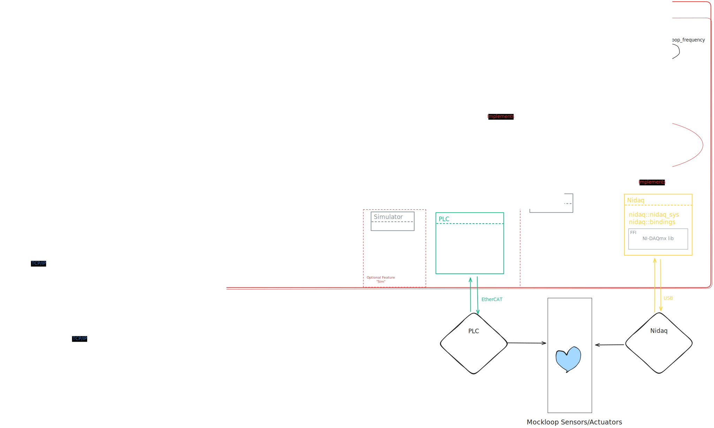

# API endpoints and structure definitions

A list of HTTP endpoints are exposed by the application, note that all GET/POST
endpoints expect a JSON-serialized structure following the precise definition
given below.

## GET Endpoints

`"/heartbeat"`
Returns a heartbeat message, useful to check if & for how long the server is
alive.

```rust
pub struct HeartbeatMessage {
    status: &'static str,
    timestamp: DateTime<Utc>,
}
```

`"/measurements"`
Returns the latest measurement fetched from the mockloop microcontroller.

```rust
pub struct Report {
    right_preload_pressure_mmhg: f32,
    left_preload_pressure_mmhg: f32,
    right_afterload_pressure_mmhg: f32,
    left_afterload_pressure_mmhg: f32,
    systemic_flow_l_per_min: f32,
    pulmonary_flow_l_per_min: f32,
    heart_rate: f32,
    pressure: f32,
    systole_ratio: f32,
    systemic_resistance: f32,
    pulmonary_resistance: f32,
    left_afterload_compliance: f32,
    right_afterload_compliance: f32,
    time: i64,
    experiment_id: String,
    experiment_name: String,
    experiment_description: String,
}
```

`"/experiment/status"`
Returns the status of the currently running experiment. If the `is_running`
field is false no experiment is running and the rest of the fields will contain
garbage.

```rust
pub struct ExperimentStatus {
    is_running: bool,
    experiment_id: Uuid,
    experiment_name: String,
    description: String,
    table_name: String,
    start_time: DateTime<Utc>,
    duration_seconds: Duration,
}
```

## POST Endpoints

`"/control/loop"`
Change the setpoints for the mockloop hemodynamics controller, this complete
structure should be present.

```rust
pub struct MockloopSetpoint {
    pub systemic_resistance: f32,
    pub pulmonary_resistance: f32,
    pub systemic_afterload_compliance: f32,
    pub pulmonary_afterload_compliance: f32,
}
```

`"/control/heart"`
Change the setpoints for the mockloop heart controller, this complete structure
should be send.

```rust
pub struct HeartControllerSetpoint {
    /// Desired heart rate
    pub heart_rate: Frequency,
    /// Desired regulator pressure
    pub pressure: Pressure,
    /// Ratio of systole duration to total cardiac phase duration
    pub systole_ratio: f32,
}
```

`"/experiment/list"`
List all previous & running experiments. Note this returns a `Vec<Experiment>`,
where `Experiment` is defined as:

```rust
pub struct Experiment {
    pub is_running: bool,
    pub id: Uuid,
    pub name: String,
    pub description: String,
    pub table_name: String,
    pub start_time: DateTime<Utc>,
    pub duration_seconds: Duration,
}
```

`"/experiment/start"`
Start a new experiment, the following data has to be provided:

```rust
pub struct ExperimentStartMessage {
    name: String,
    description: String,
}
```

`"/experiment/stop"`
Stop the current experiment, no structure has to be provided.

# loop-sense

A data acquisition and control application for the Holland Hybrid Heart mockloop
designed to run on a SBC (e.g. Raspberry pi 3/4/5).
It interfaces with a microcontroller/PLC via EtherCAT, logs sensor data and
mockloop state to InfluxDB3 and hosts a web interface for monitoring.


# Architecture



# Features

- Modular Async Rust using the [Tokio] executor.
- Designed to work with [Influxdb3], a time-series optimized DB.
- Structured logging via [Tracing], optionally exported to InfluxDB3.
- Uses the [Axum] web framework.
- Optional: High-frequency mockloop data acquisition and control via DAQ/NIDAQ
  (Replacing the PLC).

# Building

First install [Rust].

To build this application you must first obtain a rust toolchain.
[Rustup] is the default Rust toolchain manager, on unix & MacOS install it using `curl --proto '=https' --tlsv1.2 -sSf https://sh.rustup.rs | sh`.
If you are on windows [refer here](https://forge.rust-lang.org/infra/other-installation-methods.html).

If you use nix, running `nix develop` will set up the Rust toolchain and other
dependencies like [Influxdb3] (tip: use [Direnv] to automate this).

You can now build as any [Cargo] project (e.g. `cargo build`), [Rustup] will
pull the required toolchain on first build. Don't forget to look at the
features below to enable/disable certain optional parts.

The nix flake also exposes some build targets available through `nix build
.#{target}`.

## Build features

To optionally enable/disable certain logic Rust uses features, these are similar
to C/C++ Defines. Loop-sense can be build with following features:

| Feature      | Description                                                              |
| ------------ | ------------------------------------------------------------------------ |
| sim-mcu      | Enable Simulation of microcontroller, useful for development and testing |
| sim-frontend | Enable Simulation of the backend, useful for development and testing     |

# TODO

- [x] Remove nidaq cruft
- [ ] implement hydraulic resistance/compliance uom quantities
- [ ] str& instead of String everywhere
- [ ] tidy up public/private access

[Tokio]: https://crates.io/crates/tokio
[Tracing]: https://crates.io/crates/tracing
[Influxdb3]: https://github.com/influxdata/influxdb
[Axum]: https://crates.io/crates/axum
[Direnv]: https://direnv.net/
[Rustup]: https://www.rust-lang.org/tools/install
[Cargo]: https://doc.rust-lang.org/cargo/
[Rust]: https://www.rust-lang.org/
