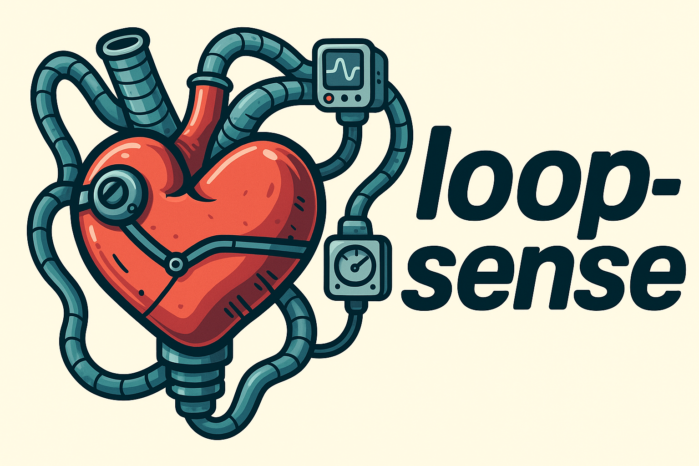

# Loop-Sense HHH mockloop backend software

A high-level control and data acquisition application for the HHH mockloop, designed to run on a Raspberry Pi embedded system within the mockloop control box.

## About the Holland Hybrid Heart Project

The [Holland Hybrid Heart](https://hollandhybridheart.nl/) project aims to develop a biocompatible artificial heart using soft robotics and tissue engineering. This innovative artificial heart is designed to help heart failure patients by improving life expectancy and quality of life. It reduces the dependency on donor hearts, addressing the shortage of available donor organs and improving patient outcomes.

## What is a Mockloop?

A mockloop (also called a mock circulatory loop) is a physical simulator that replicates the human cardiovascular system for testing cardiac devices. It consists of:

- **Pumps** that simulate heart ventricles
- **Pressure chambers** representing different parts of the circulatory system
- **Flow sensors** and **pressure sensors** for monitoring
- **Controllable resistances** to simulate blood vessel properties
- **Compliance chambers** to mimic arterial elasticity

Mockloops are essential for:

- Testing artificial hearts and ventricular assist devices
- Validating control algorithms in a controlled environment
- Collecting performance data before animal or clinical trials
- Training medical professionals on the artificial heart device operation

## Overview

Loop-sense serves as the bridge between the web-based frontend interface and the low-level microcontroller hardware. It receives control setpoints from the frontend via HTTP API, forwards them to the microcontroller over UART, and exposes sensor measurements and system status back to the frontend.

**Key responsibilities:**

- **Control Interface**: Receives setpoints from web frontend and forwards them to the microcontroller
- **Data Acquisition**: Collects measurement reports from the microcontroller and serves them via HTTP endpoints
- **Experiment Management**: Handles experiment lifecycle (start/stop) and logs data to InfluxDB
- **System Monitoring**: Provides heartbeat and status endpoints for system health monitoring

## Architecture

The application is built using **Rust** with the **Tokio** async runtime, designed around a multi-task architecture where each major function runs in its own async task with structured communication channels between them.


### Main Application Flow

The `main()` function serves as the orchestrator:

1. **Initialize logging** using the `tracing` crate
2. **Create inter-task communication channels** (mpsc/watch channels)
3. **Initialize shared application state** wrapped in Arc<Mutex<>>
4. **Spawn async tasks** for each major subsystem
5. **Start HTTP server** using Axum web framework

### Core Tasks

- **`micro_communication_task`**: Handles all UART communication with the microcontroller. Sends setpoints and receives measurement reports at 100Hz
- **`control_loop`**: High-level control logic that processes MCU reports, updates application state, and coordinates between frontend and hardware
- **`manage_experiments`**: Manages experiment lifecycle, generates UUIDs for new experiments, and coordinates data logging
- **`communicate_with_db`**: Batches and writes measurement data to InfluxDB when experiments are running
- **HTTP handlers**: Axum-based REST API serving measurement data and accepting control commands

### Key Libraries

- **`tokio`**: Async runtime providing the task scheduler, I/O primitives, and communication channels
- **`axum`**: Modern web framework for the HTTP API, with built-in JSON serialization and routing
- **`tokio-serial`**: Async UART communication with the microcontroller
- **`influxdb`**: Time-series database client for logging experimental data
- **`love-letter`**: Shared library crate defining the communication protocol between this application and the microcontroller
  - Uses **UART + COBS encoding** for reliable framing over serial
  - Uses **postcard** for efficient binary serialization/deserialization of structured data

## Development Setup

This project uses **Nix** for reproducible development environments and cross-compilation toolchains.

### Installing Nix

**Linux/macOS:**

```bash
curl --proto '=https' --tlsv1.2 -sSf https://sh.rustup.rs | sh
```

**Windows:**
Install via the [official installer](https://nixos.org/download.html#nix-install-windows) or use Windows Subsystem for Linux (WSL).

### Development Workflow

1. **Enter the development shell:**

   ```bash
   nix develop
   ```

   This automatically sets up the Rust toolchain, cross-compilation targets, and all dependencies.

2. **Build the project:**

   ```bash
   cargo build
   ```

3. **Run with simulation features (for development without hardware):**

   ```bash
   cargo run --features sim-mcu
   ```

4. **Cross-compile for Raspberry Pi:**
   ```bash
   cargo build --target aarch64-unknown-linux-musl --release
   ```

### Build Features

- `sim-mcu`: Replaces UART communication with a simulator for development
- `sim-frontend`: Enables additional simulation features for testing without a frontend

The Nix flake also provides several build targets accessible via `nix build .#{target}` for various cross-compilation scenarios.

## API endpoints and structure definitions

A list of HTTP endpoints are exposed by the application, note that all GET/POST
endpoints expect a JSON-serialized structure following the precise definition
given below.

### GET Endpoints

`"/heartbeat"`
Returns a heartbeat message, useful to check if & for how long the server is
alive.

```rust
pub struct HeartbeatMessage {
    status: &'static str,
    timestamp: DateTime<Utc>,
}
```

`"/measurements"`
Returns the latest measurement fetched from the mockloop microcontroller.

```rust
pub struct Report {
    pulmonary_preload_pressure: f32,
    systemic_preload_pressure: f32,
    pulmonary_afterload_pressure: f32,
    systemic_afterload_pressure: f32,
    systemic_flow_l_per_min: f32,
    pulmonary_flow_l_per_min: f32,
    heart_rate: f32,
    pressure: f32,
    systole_ratio: f32,
    systemic_resistance: f32,
    pulmonary_resistance: f32,
    systemic_afterload_compliance: f32,
    pulmonary_afterload_compliance: f32,
    time: i64,
    experiment_id: String,
    experiment_name: String,
    experiment_description: String,
}
```

`"/experiment/status"`
Returns the status of the currently running experiment. If the `is_running`
field is false no experiment is running and the rest of the fields will contain
garbage.

```rust
pub struct ExperimentStatus {
    is_running: bool,
    experiment_id: Uuid,
    experiment_name: String,
    description: String,
    table_name: String,
    start_time: DateTime<Utc>,
    duration_seconds: Duration,
}
```

### POST Endpoints

`"/control/loop"`
Change the setpoints for the mockloop hemodynamics controller, this complete
structure should be present.

```rust
pub struct MockloopSetpoint {
    pub systemic_resistance: f32,
    pub pulmonary_resistance: f32,
    pub systemic_afterload_compliance: f32,
    pub pulmonary_afterload_compliance: f32,
}
```

`"/control/heart"`
Change the setpoints for the mockloop heart controller, this complete structure
should be send.

```rust
pub struct HeartControllerSetpoint {
    /// Desired heart rate
    pub heart_rate: Frequency,
    /// Desired regulator pressure
    pub pressure: Pressure,
    /// Ratio of systole duration to total cardiac phase duration
    pub systole_ratio: f32,
}
```

`"/experiment/list"`
List all previous & running experiments. Note this returns a `Vec<Experiment>`,
where `Experiment` is defined as:

```rust
pub struct Experiment {
    pub is_running: bool,
    pub id: Uuid,
    pub name: String,
    pub description: String,
    pub table_name: String,
    pub start_time: DateTime<Utc>,
    pub duration_seconds: Duration,
}
```

`"/experiment/start"`
Start a new experiment, the following data has to be provided:

```rust
pub struct ExperimentStartMessage {
    name: String,
    description: String,
}
```

`"/experiment/stop"`
Stop the current experiment, no structure has to be provided.
